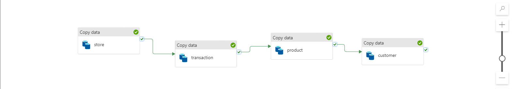
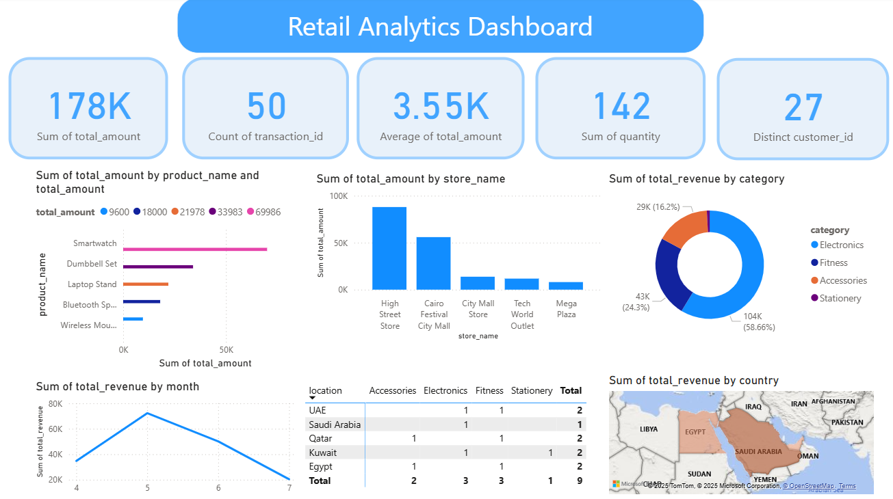

# Azure-Data-Pipeline-Retails-Project

## 📊 Project Overview
End-to-end data engineering pipeline on Microsoft Azure for retail analytics.

## 🏗️ Architecture

**Components:**
- **Source**: Azure SQL Server (Products, Stores, Transactions, Customers)
- **Ingestion**: Azure Data Factory pipelines
- **Storage**: Azure Data Lake (Parquet files)
- **Processing**: Azure Databricks (PySpark)
- **Visualization**: Power BI Dashboard

## 🚀 Implementation

### 1. Azure SQL Database
- Created SQL Server instance
- Ran scripts to create 4 tables (products, stores, transactions, customers)
- Loaded sample retail data

### 2. Azure Data Lake
- Created Storage Account container: `retail-db`
- Configured Bronze layer structure

### 3. Data Factory Pipelines

- 4 Copy Data activities (store, transaction, product, customer)
- Source: SQL Server → Destination: storage account(Data Lake)
- All pipelines executed successfully

### 4. Databricks Processing

#### Bronze Layer (Raw)
- `transactions_bronze`
- `customers_bronze`
- `stores_bronze`
- `products_bronze`

#### Silver Layer (Cleaned)
- Joined all tables to be 'One Big Table'
- Table: `db_silver`

#### Gold Layer (Insights for Analytics) - 14 Tables:
1. `db_top_products_gold` - Top products by revenue
2. `df_summary_gold` - Product-country-store summary
3. `monthly_sales_trend_gold` - Monthly revenue trends
4. `top_customers_gold` - Top 10 customers
5. `store_performance_gold` - Store metrics
6. `category_performance_gold` - Category analysis
7. `country_sales_gold` - Country-wise sales
8. `product_store_matrix_gold` - Product-store performance
9. `customer_segmentation_gold` - VIP/High Value/Regular/Occasional
10. `daily_sales_gold` - Daily metrics
11. `product_rankings_gold` - Products ranked by revenue
12. `location_category_gold` - Geographic-category analysis
13. `customer_lifetime_value_gold` - CLV analysis
14. `store_country_distribution_gold` - Store-country revenue

### 5. 📊 Power BI Dashboard
Connected to Gold layer for interactive visualizations

## 🛠️ Tech Stack
- Azure SQL Database
- Azure Data Lake Storage Gen2
- Azure Data Factory
- Azure Databricks (PySpark)
- Power BI

## 🙏 Acknowledgments
Special thanks to Eng. Mohamed Hamed for his guidance.
